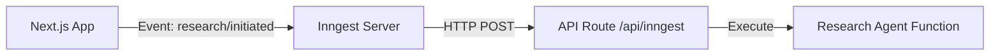

# Inngest Implementation Guide

This document outlines the Inngest architecture used in the Deep Research Agent and provides debugging steps.

## Architecture

Inngest is an event-driven queue and background job system. In our Next.js app, it works as follows:

1.  **Client (`inngest/client.ts`)**: Initializes the Inngest instance.
2.  **API Route (`app/api/inngest/route.ts`)**: This is the "Serve Handler". It exposes our functions to the Inngest Cloud (or local dev server).
3.  **Functions (`inngest/research-agent.ts`)**: Define the business logic (steps) that run in the background.



## How It Works Locally

When you run `npx inngest-cli dev`:

1.  It starts a local Inngest server (dashboard at `http://localhost:8288`).
2.  It polls your Next.js app at `http://localhost:3000/api/inngest` to "discover" functions.
3.  When an event is sent (`inngest.send(...)`), the CLI receives it and triggers the function by calling your API route.

## Debugging

If functions aren't running or are using old code:

1.  **Check Discovery**: Look at the Inngest Dev Server logs. It should say "Function found: Deep Research Agent".
2.  **Restart Dev Server**: Sometimes the Inngest CLI loses connection to the Next.js app. Restarting `npx inngest-cli dev` usually fixes this.
3.  **Check API Route**: Ensure `app/api/inngest/route.ts` is correctly exporting the handler with the updated list of functions.

### Files to Verify

- **`app/api/inngest/route.ts`**: Must include the function in the `functions` array.

  ```typescript
  import { researchAgent } from "@/inngest/research-agent";

  export const { GET, POST, PUT } = serve({
    client: inngest,
    functions: [researchAgent], // <--- MUST be here
  });
  ```

- **`inngest/research-agent.ts`**: The actual logic. Prioritize `step.run()` for distinct phases.

## Common Errors

- **Step execution failed**: Check the logs in the Inngest Dashboard.
- **Non-deterministic code**: Ensure code inside `step.run` is deterministic or handles retries gracefully.
- **Env Vars**: Background functions need access to environment variables (like API keys). Since we fetch the API key from the DB at runtime, this is handled securely.
