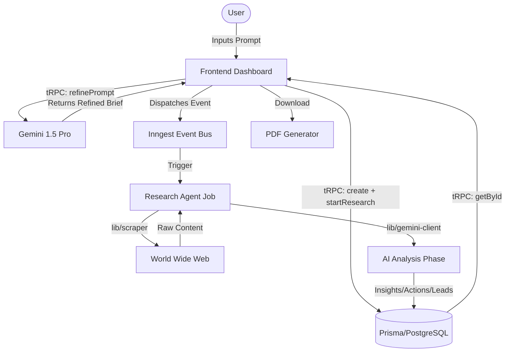

# Deep Research Agent Implementation Details

This document provides a comprehensive technical breakdown of the Deep Research Agent module implemented in the Baserow application.

## 1. Overview

The Deep Research Agent is an AI-powered system designed to perform deep market research, web analysis, and lead generation. It automates the process of scouring the web, synthesizing data into insights, and creating actionable items or business leads.

---

## 2. Architecture & Data Flow



---

## 3. File Structure Breakdown

### 🗄️ Database (Prisma)

- **File:** `prisma/schema.prisma`
- **Key Models:**
  - `Research`: Core mission record tracking status, progress, and prompts.
  - `ResearchSource`: Linked URLs and excerpts analyzed by the agent.
  - `ResearchInsight`: AI-synthesized findings categorized by impact.
  - `ActionItem`: Execution steps derived from research.
  - `LeadData` & `Lead`: Structured business data for outreach missions.

### 🛡️ Backend Utilities (`lib/`)

- `encryption.ts`: Handles AES-256-CBC encryption for user-provided Gemini API keys.
- `gemini-client.ts`: Wrapper for `@google/generative-ai` to handle prompt refinement and deep analysis.
- `scraper.ts`: Puppeteer-based utility for extracting clean text from target URLs.
- `pdf-generator.ts`: Browser-compatible PDF creation using `jsPDF`.

### ⚡ API & Orchestration

- **tRPC Router:** `server/routers/research.ts`
  - Procedures: `create`, `refinePrompt`, `startResearch`, `list`, `getById`, `convertActionToTask`, `delete`.
- **Inngest:** `inngest/research-agent.ts`
  - Orcherstrates the multi-step background process: Discovery -> Scraping -> Semantic Analysis -> Storage.
- **Route:** `app/api/inngest/route.ts`

### 🎨 Frontend Core

- **Pages:**
  - `app/(dashboard)/research/page.tsx`: Main dashboard and mission list.
  - `app/(dashboard)/research/[id]/page.tsx`: Detail view with tabbed navigation.
- **Components:**
  - `ResearchCreationModal.tsx`: Multi-step AI consultant flow.
  - `ResearchOverview.tsx`: Progress tracking and metadata.
  - `ResearchSources.tsx`: Source transparency and credibility listing.
  - `ResearchInsights.tsx`: Synthesized market patterns.
  - `ResearchActionItems.tsx`: Bridge between research and task execution.
  - `ResearchLeads.tsx`: Lead mining and outreach templates.

---

## 4. Key Functional Flows

### Mission Creation & AI Refinement

When a user submits a research request, it is first sent to **Gemini 1.5 Pro** to be expanded into a professional briefing. This ensures the background agent has enough context to find high-quality data.

### Background Processing (The "Agent")

The agent runs in an isolated Inngest container. It scrapes sources concurrently, uses AI to extract semantic meaning, and filters out noise to produce structured insights.

### Action Item to Task Conversion

Any `ActionItem` generated during research can be "Promoted" to a real `Task` in the application's planning module, ensuring that research leads directly to execution.

---

## 5. Security Details

- **API Key Security:** User API keys are never stored in plain text. They are encrypted using `ENCRYPTION_SECRET` and decrypted only in-memory during active research runs.
- **Protected Procedures:** All tRPC endpoints require a valid user session.

---

## 6. Required Environment Variables

```bash
# Inngest
INNGEST_EVENT_KEY=your_key
INNGEST_SIGNING_KEY=your_key

# Security
ENCRYPTION_SECRET=your_32_char_secret

# Research Limits
MAX_CONCURRENT_RESEARCH=3
RESEARCH_TIMEOUT_MINUTES=15
MAX_SOURCES_PER_RESEARCH=10
```

---

## 7. Implementation Checklist (Completed)

- [x] Prisma Schema Migration
- [x] Backend Utility Implementation (Encryption, Scraper, AI)
- [x] tRPC Router Registration
- [x] Inngest Job Handler
- [x] Dashboard & Creation Modal
- [x] Detail View with Tabbed Results
- [x] PDF Export Functionality
- [x] Task Module Integration
