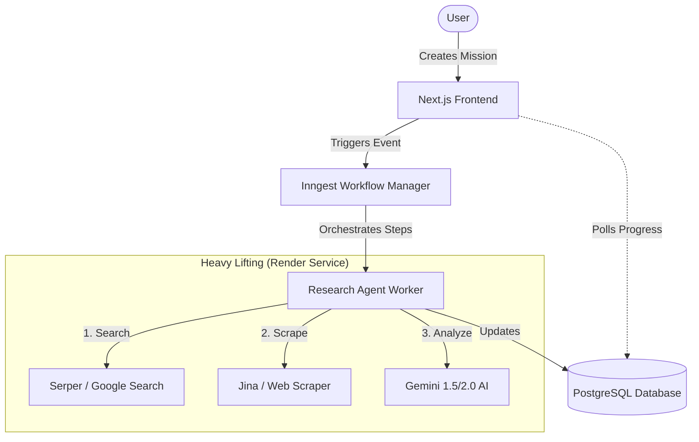

# 🧠 The Deep Research Agent: Comprehensive Overview

The Deep Research Agent is a sophisticated, multi-stage AI system designed to handle complex research missions. It bypasses traditional web search limitations by using autonomous "agents" that can browse the web, analyze content, and synthesize results into actionable business insights.

---

## 🏗️ How It Works (For Everyone)

Think of the Research Agent as a **highly skilled digital intern**.

1. **The Request**: You give it a mission (e.g., "Find the top 10 marketing agencies in London specializing in SaaS").
2. **The Plan**: It clarifies the request and plans its search strategy.
3. **The Hunt**: It goes out to the web, searching through Google and actually visiting/reading websites.
4. **The Analysis**: It reads thousands of words of text, looks for patterns, and pulls out the most important facts.
5. **The Delivery**: It organizes everything into clear summaries, key insights, and actionable "next steps" (like tasks or leads).

---

## 🔄 The Technical Architecture

To handle heavy research without slowing down the main application, the system uses a **distributed architecture**.

### Key Components

- **Vercel (The Brain)**: Handles the user interface and quick API requests.
- **Inngest (The Conductor)**: Manages the sequence of events. If a mission takes 20 minutes, Inngest ensures it finishes correctly, handles retries, and tracks progress.
- **Render (The Engine Room)**: A dedicated server that handles the "heavy lifting"—the intensive web scraping and AI processing that would normally time out on a standard website.

---

## 🛠️ The Technology Stack

| Tool                | Role         | Why We Use It                                                                           |
| :------------------ | :----------- | :-------------------------------------------------------------------------------------- |
| **Gemini (Google)** | The "Brain"  | High intelligence for analysis and "Grounding" (verifying facts with Google Search).    |
| **Serper.dev**      | The "Eyes"   | Provides high-quality Google Search results programmatically.                           |
| **Jina AI**         | The "Reader" | "Cleans" websites by turning messy HTML into simple text that AI can easily understand. |
| **Puppeteer**       | The "Hands"  | A virtual browser used when we need to visit complex websites that require interaction. |
| **Prisma/Postgres** | The "Memory" | Stores every source, insight, and lead discovered during the mission.                   |

---

## 🚀 The Life of a Research Mission (Step-by-Step)

### 1. Ingestion & Refinement

When you type a prompt, Gemini first **refines** it. It turns a simple "Find agencies" into a detailed research objective. This ensures the agent knows _exactly_ what to look for.

### 2. The Search Phase

Depending on the mode selected:

- **Standard (Grounding)**: Uses Gemini's built-in Google Search to find facts quickly.
- **Deep Research**: Goes multiple layers deep. It searches, reads, finds "gaps" in what it knows, and searches _again_ to fill those gaps.

### 3. Web Scraping (The "Reading" Step)

The agent visits the most promising URLs. It uses **Jina AI** to extract the text, removing ads and navigation links so the AI only sees the actual content.

### 4. Intelligence Synthesis

Once the agent has the text, it runs an **Analysis Loop**:

- **Summarization**: Creates a high-level overview of the findings.
- **Insight Extraction**: Identifies key facts, trends, or competitive intelligence.
- **Confidence Scoring**: Assigns a "confidence level" (High/Medium/Low) to its findings.

### 5. Ingestion of Results

Results are saved directly to the database:

- **Sources**: Links to the original websites.
- **Insights**: Bite-sized findings for the user.
- **Action Items**: Specific tasks generated from the findings.
- **Leads**: If requested, specific companies and contact patterns.

### 6. Final Delivery

The user sees the "Completed" status on their dashboard. They can now convert action items into **Tasks** or export the **Leads** to their CRM.

---

## 💡 Advanced: Deep Research vs. Standard

- **Standard Mode**: Best for quick facts. Uses "Grounding" to cite sources for its claims.
- **Deep Research Mode**: An **autonomous loop**. The agent actually _thinks_ about what it found, identifies what is missing, and performs follow-up searches until it is satisfied. This can take several minutes but provides much higher quality results.
